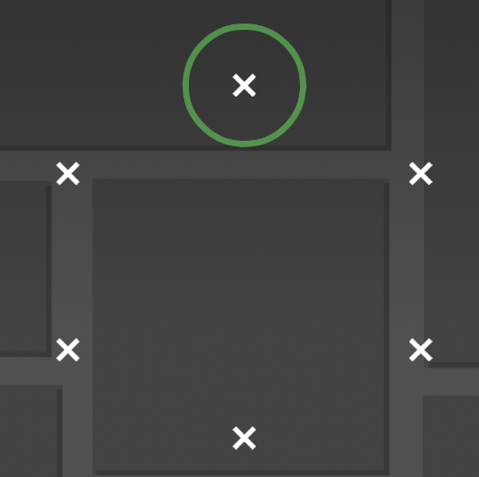

# Project: Selector Panel

Let's put everything we have learned into use!

When creating things other than levels in Geometry Dash, one of the biggest challenges is _controls_. Since there are only 2 buttons to use, it is often hard to make your creation easy to understand for players.

One of the most common solutions to this is making a _selector panel_, where you use one button to choose an action, and the other to perform the action.

## Setting up the editor

You could technically do this all in SPWN, but when making the graphical bits, it's often more useful to visually see what we're doing. Therefore, we will do some setup in the gd level editor before we apply a SPWN script on it.

First off, we need to place where our buttons should be. To do this, we're going to place some objects (with one group each) in a pattern of our choosing. I chose a hexagon (because hexagons are the bestagons).


Next up, we need some kind of graphical element to show which button is currently selected. To do this, I just used a circle, but you can get as creative as you like.

Here's my final setup:



## Writing the program

Ok, let's write an actual SPWN program!

First things first, let's take the groups we assigned to the objects we already placed in the level, and store them in variables. Let's start with the objects we placed first, which were the ones that decided the position of out buttons. I'm going to call them _anchors_ from now on. Let's also store them in an array, in case we want to add more buttons later.

```spwn
// Groups of the objects that decide the position of
// our buttons
anchors = [1g, 2g, 3g, 4g, 5g, 6g]

// Group of the object(s) that indicate which
// button is currently selected
selector = 7g
```

Next up, we need to get input from our user. As many who has tried making something with Geometry Dash triggers before knows, managing input in Geometry Dash can be very frustrating. Luckily, there is a library that comes with SPWN that makes it super simple, so you don't have to think about it at all. This library is called _gamescene_, and includes some features which are very useful for making controls. Let's import it using an `import` expression:

```spwn
gs = import gamescene
```

Now we can have some code run when we click one of the buttons. I'm going to choose the left button for switching, and the right side for activating. The left side is `button_a`:

```spwn
gs.button_a().on_triggered(!{
    // switch
})
```

Let's add a variable to keep track of what button is currently selected. For this, we will use a counter.

```spwn
// starts at first button (index 0)
selected = counter(0)

gs.button_a().on_triggered(!{
    // switch
})
```

> **Note:** It might feel more intuitive to make a mutable variable with `let`, instead of a counter. However this will not work, as you will see if you try it out...

Ok, let's make the button switch inside the function we just created. Here's what it needs to do:

- 1: Increment the `selected` variable

```spwn
selected += 1
```

- 2: Check if the `selected` variable value has reached the number of buttons, and if so, reset it to 0.

```spwn
if selected == anchors.length {
    selected -= anchors.length
    wait()
}
```

(I added a little delay after the operation to make it more reliable, more about this in the next chapter)

> **Note:** We could say `selected = 0` instead, but `-=` is actually way cheaper and more reliable since it's in the game by default. If you really want to use `selected = 0`, go for it.

- 3: Move the selector to the right anchor

```spwn
current_anchor = anchors[selected]
selector.move_to(current_anchor)
```

Here's what we have so far:

```spwn
// Groups of the objects that decide the position of
// our buttons
anchors = [1g, 2g, 3g, 4g, 5g, 6g]

// Group of the object(s) that indicate which
// button is currently selected
selector = 7g

gs = import gamescene

// starts at first button (index 0)
selected = counter(0)

gs.button_a().on_triggered(!{
    // switch
    selected += 1
    if selected == anchors.length {
        selected -= anchors.length
        wait()
    }
    current_anchor = anchors[selected]
    selector.move_to(current_anchor)
})
```

However, if we try to run this, it will return an error:

```
Error at d:\spwn\spwn-lang\test\test.spwn:21:22
   |
21 |     current_anchor = anchors[selected]
   |                      ^^^^^^^^^^^^^^^^^
expected @number in index, found @counter
```

SPWN needs the index to be a normal number, not a counter! Luckily, since we know our `selected` counter will only be a value from 0 up to (and not including) the number of buttons, we can convert it to a normal number using the `.to_const` macro:

```spwn
current_anchor = anchors[
    selected.to_const(0..anchors.length)
]
```

**Here is the final product:**

```spwn
// Groups of the objects that decide the position of
// our buttons
anchors = [1g, 2g, 3g, 4g, 5g, 6g]

// Group of the object that indicates which
// button is currently selected
selector = 7g

gs = import gamescene

// starts at first button (index 0)
selected = counter(0)

gs.button_a().on_triggered(!{
    // switch
    selected += 1
    if selected == anchors.length {
        selected -= anchors.length
        wait()
    }
    current_anchor = anchors[
        // convert selected to a normal number
        selected.to_const(0..anchors.length)
    ]
    selector.move_to(current_anchor)
})
```

[**Next page**](triggerlanguage/8bugfixing.md)
